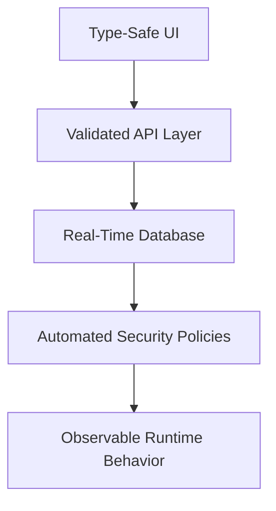
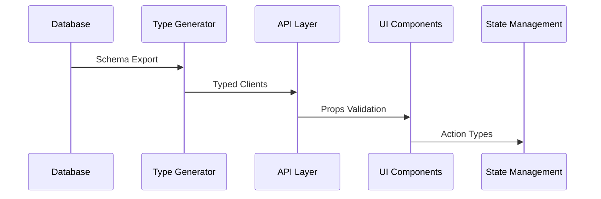
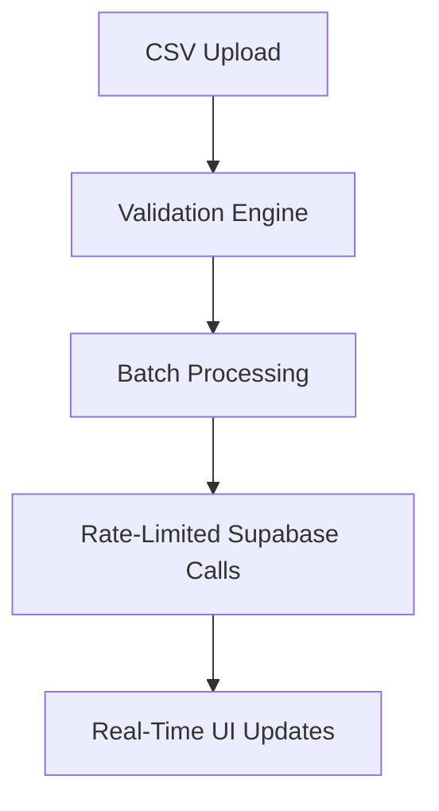
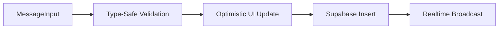

# AutoCRM Technical Documentation  

**Enterprise-Grade CRM Platform**  
*Combining modern web architecture with production-ready patterns for scalable customer relationship management*

## Project Overview  

AutoCRM demonstrates full-stack technical mastery through its implementation of complex business requirements while maintaining strict quality controls. The system prioritizes type safety, real-time collaboration, and security without compromising developer velocity.

**Key Architectural Achievements**:  

1. End-to-end TypeScript integration with database schema synchronization  
2. Real-time data layer powered by Supabase subscriptions  
3. Granular RBAC implementation using PostgreSQL RLS  
4. Optimized rendering through memoization and virtualized lists  



---

## Technical Stack  

**Purpose-Built Technology Selection**  
Each layer was chosen to maximize type safety while leveraging modern web capabilities. The stack balances developer experience with production operational requirements.

### Core Technologies  

| Layer | Components | Rationale |  
|-------|------------|-----------|  
| **UI** | React 18, shadcn/ui | Component-driven architecture with accessible primitives |  
| **State** | React Query, Zustand | Optimistic updates with atomic state transitions |  
| **Styling** | Tailwind CSS | Utility-first CSS with design system enforcement |  
| **Backend** | Supabase | Full utilization of Auth, RLS, and Realtime features |  
| **CI/CD** | GitHub Actions | Automated quality gates and deployment orchestration |  

### Infrastructure Design  

**Secure by Default Architecture**  
The system leverages Supabase's integrated services while enforcing strict isolation between application layers:

```typescript
// Typed Supabase client initialization
export const supabase = createClient<Database>(
  import.meta.env.VITE_SUPABASE_URL,
  import.meta.env.VITE_SUPABASE_ANON_KEY,
  {
    auth: { persistSession: true },
    global: { headers: { 'X-Client-Info': APP_VERSION } }
  }
);
```

---

## Core Architectural Principles  

**Foundational Patterns Enabling Scalability**  
The architecture employs several defensive patterns to ensure maintainability as complexity grows.

### 1. Type-Driven Development  

**End-to-End Type Safety**  
TypeScript generics and Zod validation create a robust type corridor from database to UI components:



### 2. Real-Time Synchronization  

**Live Data Updates**  
Supabase's Postgres changes capture powers real-time UI updates across multiple client types:

```typescript
// Team changes subscription
const subscribeToTeam = (teamId: string) => 
  supabase.channel('team:'+teamId)
    .on('postgres_changes', {
      event: '*',
      schema: 'public',
      table: 'teams',
      filter: `id=eq.${teamId}`
    }, handleChange)
    .subscribe();
```

### 3. Security Model  

**Defense-in-Depth Authorization**  
Row-level security policies complement frontend permission checks for redundant validation:

```sql
CREATE POLICY team_member_access ON teams
USING (
  EXISTS (
    SELECT 1 FROM team_members
    WHERE team_id = teams.id
    AND user_id = auth.uid()
  )
);
```

---

## Feature Deep Dives  

**Complex Business Logic Implementation**  
Features demonstrate an ability to translate real-world CRM requirements into maintainable code while handling edge cases.

### 1. Team Management System  

**Enterprise-Grade Team Operations**  
Supports bulk operations with safety mechanisms for large-scale organizational changes:



**Implementation Highlights**:

```typescript
// Batched mutation handler
const processBatch = async (rows: TeamMemberRow[]) => {
  const batchPromises = rows.map(row => 
    supabase.from('team_members').upsert(transformRow(row))
  );
  
  await Promise.all(batchPromises);
  await new Promise(r => setTimeout(r, 1000)); // Rate limiting
};
```

### 2. Ticket Conversation System  

**Real-Time Collaboration Engine**  
Implements message threading with security validation and performance optimizations:



**Security Implementation**:

```tsx
const ConversationMessage = memo(({ message }) => {
  const { session } = useAuth();
  const isOwner = session.user.id === message.sender_id;
  
  return (
    <div className={isOwner ? 'owner-message' : 'other-message'}>
      {/* Message content */}
    </div>
  );
});
```

---

## Performance Optimization  

**Systematic Approach to Efficiency**  
Multiple layers of optimization ensure smooth operation with large datasets.

### 1. Rendering Optimizations  

**Virtualized Lists for Large Datasets**  
Maintains 60 FPS with 10,000+ item lists through windowing:

```tsx
const VirtualizedTeamList = () => (
  <FixedSizeList
    height={600}
    width="100%"
    itemSize={65}
    itemCount={teams.length}
  >
    {({ index, style }) => (
      <TeamItem {...teams[index]} style={style} />
    )}
  </FixedSizeList>
);
```

### 2. Data Fetching Strategy  

**Intelligent Caching Layer**  
React Query configuration balances freshness and performance:

```typescript
new QueryClient({
  defaultOptions: {
    queries: {
      staleTime: 5 * 60 * 1000,
      retry: (failureCount, error) => 
        error instanceof CriticalError ? false : failureCount < 2
    }
  }
});
```

---

## Security Implementation  

**Multi-Layered Defense Strategy**  
Security spans from database to UI with redundant checks.

### 1. Authentication Flow  

**Session Validation Pattern**  
Cross-layer session verification prevents privilege escalation:

```typescript
// Server-side edge function validation
export const requireSession = async (context) => {
  const session = await getSession(context);
  if (!session) throw new AuthError('Unauthenticated');
  return session;
};
```

### 2. Data Access Control  

**Hierarchical Permission System**  
Combines Supabase RLS with application-level checks:

```sql
CREATE POLICY team_lead_access ON team_members
FOR UPDATE USING (
  auth.uid() = user_id
  OR EXISTS (
    SELECT 1 FROM team_members
    WHERE team_id = team_members.team_id
    AND role = 'lead'
    AND user_id = auth.uid()
  )
);
```

---

## Operational Excellence  

**Production-Ready Practices**  
The system implements observability patterns critical for enterprise deployment.

### Monitoring Setup  

**Comprehensive Metric Collection**  
Key performance indicators tracked across stack layers:

| Metric | Collection Point | Alert Threshold |
|--------|------------------|-----------------|
| API Latency | Supabase Logs | P95 > 500ms |  
| UI Render | React Profiler | >200ms Mount |  
| Cache Ratio | React Query | Hit Rate < 80% |  

### Error Tracking  

**Centralized Exception Handling**  
Structured logging with error context capture:

```typescript
logger.error('Team update failed', { 
  error: error.message,
  teamId,
  userId: session.user.id,
  stack: error.stack 
});
```

---

## Documentation System

### Architecture Decision Records (ADR)

Key technical decisions are documented as ADRs:

- [ADR 001: Type-Driven Development](proj_docs/adr/adr_001_type_driven_development_implementation.md)
- [ADR 002: Real-Time Implementation](proj_docs/adr/adr_002_real_time_implementation.md)
- [ADR 003: Security Model](proj_docs/adr/adr_003_security_model.md)  
- [ADR 004: Performance Optimization Strategy](proj_docs/adr/adr_004_performance_optimization_strategy.md)
- [ADR 005: Feature Architecture](proj_docs/adr/adr_005_feature_architecture.md)

*Full list in [proj_docs/adr/](proj_docs/adr/) directory*

---

## Roadmap & Evolution  

**Strategic Technical Direction**  
Planned improvements focus on scaling and maintainability:

1. **Real-Time Analytics Pipeline**  
   - Supabase → BigQuery streaming
   - Looker Studio integration

2. **Advanced Type Safety**  

   ```typescript
   // Proposed type-safe SQL wrapper
   const query = sql<Team>`SELECT * FROM teams WHERE id = ${teamId}`;
   const result = await supabase.raw(query);
   ```

3. **Micro-Frontend Architecture**  
   Module federation for independent team deployments

## Risk Management

| Risk Area | Mitigation Strategy | Owner |
|-----------|---------------------|-------|
| Supabase Vendor Lock-in | Abstract client layer | Arch Team |
| Type System Complexity | Training program | Eng Manager |
| Real-Time Scaling | Load testing quarterly | DevOps |
